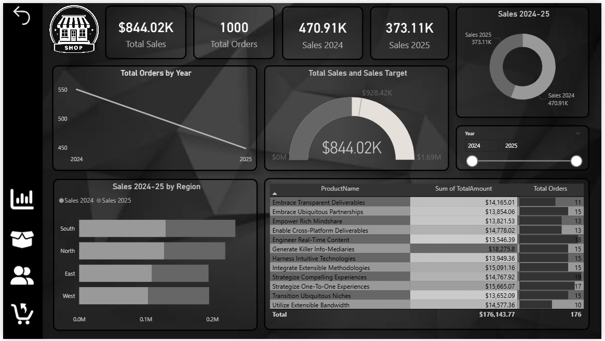
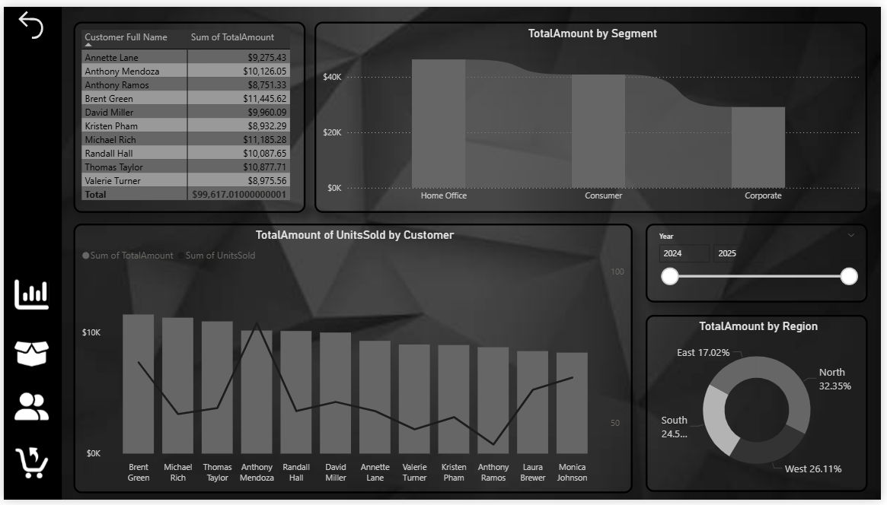
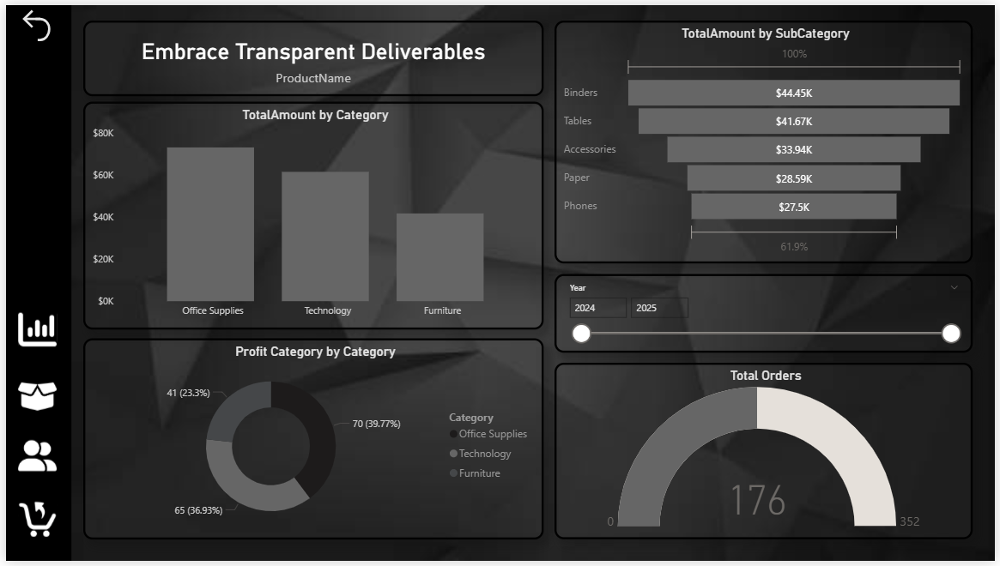

# 📊 Final Project – Sales & Customer Intelligence Dashboard (Power BI)

## 📌 Project Overview
This project is a **Final Power BI Capstone Project** focused on delivering **business insights** related to **Sales, Returns, Customer Behavior, and Regional Performance** over the last **three years**.

The report is designed for **senior leadership** and follows **industry best practices** in:
- Data Modeling (Star Schema)
- Advanced DAX
- Time Intelligence
- Interactive & Mobile-friendly Dashboard Design
- Security using Row-Level Security (RLS)

---

## 🎯 Business Objectives
- Analyze **Sales & Returns performance**
- Understand **Customer profitability and behavior**
- Identify **Top Products & Top Customers**
- Track **YOY, MOM, and YTD trends**
- Compare **Regional performance**
- Deliver an **interactive and executive-ready dashboard**

---

## 📂 Dataset
The dataset used for this project is available here:

🔗 **[Download Dataset (Excel)](./FinalProject_Dataset.xlsx)**

### Tables Included:
- Date_Dim
- Customer_Dim
- Product_Dim
- Sales_Fact
- Returns_Fact
- Region_Dim

---

## 🏗️ Data Model Design
A **Star Schema** data model is implemented for optimal performance and clarity.

### Fact Tables
- **Sales_Fact** – Transaction-level sales data  
- **Returns_Fact** – Returned product transactions  

### Dimension Tables
- **Date_Dim**
- **Customer_Dim**
- **Product_Dim**
- **Region_Dim**

✔ Proper **Primary & Foreign Keys**  
✔ Clean relationship flow (1 → Many)  
✔ Hidden technical columns for cleaner report view  

---

## 🧮 DAX Measures Used
The project uses a wide range of **DAX functions & patterns**, including:

### Core DAX Functions
- `CALCULATE`
- `FILTER`
- `ALL`
- `SUMX`
- `COUNTX`
- `AVERAGEX`
- `SWITCH`
- `RELATED`

### Key Measures
- Total Sales
- Total Returns
- Net Sales
- Profit
- Profit Margin %
- YOY Sales Growth
- MOM Sales Growth
- YTD Sales
- Top N Products by Sales
- Top N Customers by Profit

---

## ⏱️ Time Intelligence
Advanced time-based analysis implemented using **Date_Dim**:
- Year-over-Year (YOY)
- Month-over-Month (MOM)
- Year-to-Date (YTD)
- Seasonal trend identification

---
## 📊 Dashboard Pages Preview

### 🟢 Page 1: Executive Overview
- KPI Cards (Total Sales, Total Orders, Sales 2024, Sales 2025)
- Total Orders by Year (Trend)
- Sales vs Target Gauge
- Sales 2024–25 by Region
- Top Products & Orders Matrix

---

### 🔵 Page 2: Customer Analysis
- Customer-wise Total Sales
- Sales by Customer Segment
- Units Sold vs Sales by Customer
- Region-wise Contribution
- Customer performance comparison

---

### 🟡 Page 3: Product Analysis
- Sales by Category
- Sales by Sub-Category
- Profit Category Distribution
- Product-level performance insights
- Orders overview

---

### 🔴 Page 4: Return Orders Analysis
- Total Returns vs Total Orders
- Return Orders by Product
- Return Orders by Year & Quarter
- Return Amount by Return Reason
- Trend-based return insights

### 🟣 Drillthrough Page
- Customer / Product level deep-dive analysis

---

## 🎛️ Filtering & Interactions
- Slicers:
  - Date
  - Product
  - Customer Segment
  - Region
- Drill Up / Drill Down
- Drillthrough Filters
- Numeric Range Parameters
- Interactive cross-filtering

---

## 🧭 Navigation & UX Enhancements
- Custom Navigation Buttons
- Bookmarks for page navigation
- Collapsible slicer panel
- Tooltip pages with mini insights
- Advanced conditional formatting

---

## 📱 Mobile Optimization
- Dedicated **Mobile Layout**
- Focus on KPI Cards
- Top N visuals prioritized
- Clean and readable mobile experience

---

## 🔐 Security (Row-Level Security)
- Role-based security for **Region Managers**
- Users can only view data for their assigned region
- RLS tested using **View As Role**

---

## 📦 Deliverables
- ✔ Power BI Report (`.pbix`)
- ✔ Mobile Layout Preview
- ✔ Documented DAX Measures
- ✔ Interactive Multi-Page Dashboard
- ✔ Optional Walkthrough / Demo

---

## 🗂️ Files Included
